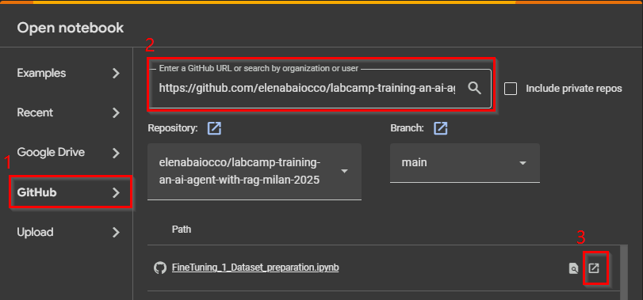

# LabCamp - Training an AI Agent with AI - Milan 2025

## Table of Contents

- [LabCamp - Training an AI Agent with AI - Milan 2025](#labcamp---training-an-ai-agent-with-ai---milan-2025)
  - [Table of Contents](#table-of-contents)
  - [Setup](#setup)
    - [Google Colab](#google-colab)
  - [RAG Pipeline](#rag-pipeline)
    - [Index creation](#index-creation)
    - [Agent creation](#agent-creation)
  - [Fine tuning](#fine-tuning)
    - [Dataset creation](#dataset-creation)
    - [Fine tuning with OpenAI API](#fine-tuning-with-openai-api)
- [Authors](#authors)

## Setup

For those of you who are not very familiar with Python development, we recommend using [Google Colab](https://colab.research.google.com/). Alternatively, you can run the code in a local environment if you know how to set it up! 😊

### Google Colab

You need a Google account to use Google Colab.
To open a notebook from this repository, follow these steps
1. Click on GitHub on the main page 
1. Paste the GitHub URL 
2. Finally, open the notebook by clicking on the rightmost icon.

During the labcamp, we will provide you with an `.env` file, containing the OpenAI API key and Document Intelligence key. This file should be uploaded in the Files section in Colab (or stored in the root directory of the local project). refer to `.env.template` for an example of how to store the keys.

## RAG Pipeline

### Index creation

### Agent creation

## Fine tuning

In `examples` folder you can find an already created dataset files, you can your for fine tuning related to an exercise: Festival di Sanremo 2024.

Thanks to this file, you can directly try the `FineTuning_2_Fine_Tuning_With_OpenAI.ipynb` by means a proper renaming inside the notebook of filenames.

### Dataset creation

### Fine tuning with OpenAI API

# Authors

- Elena Baiocco | Cluster Data IT
- Francesco Miliani | Blockchain Reply IT
